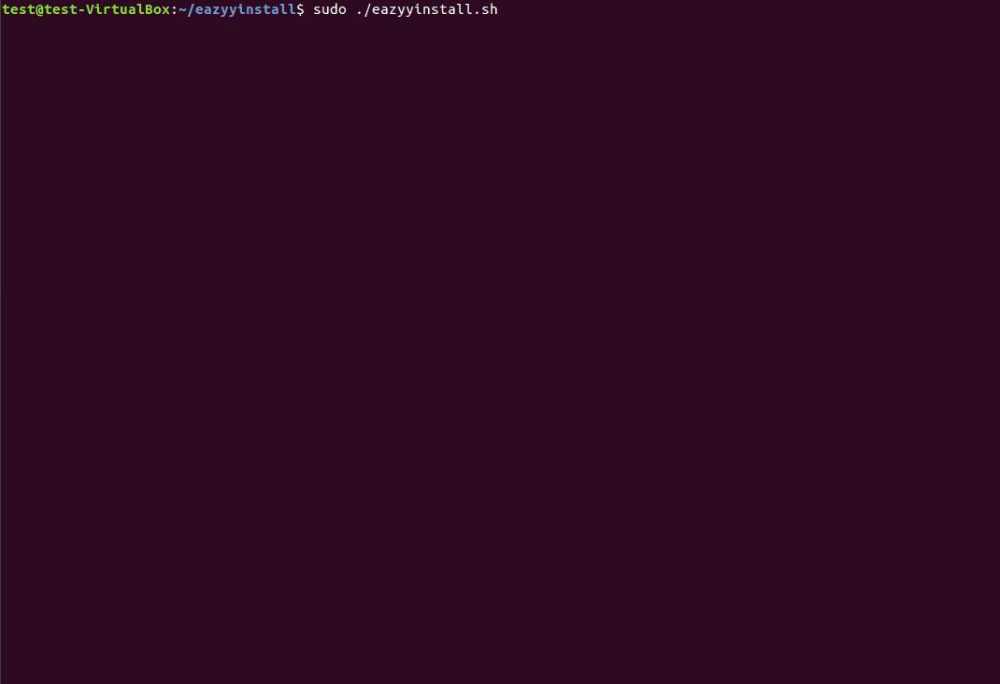
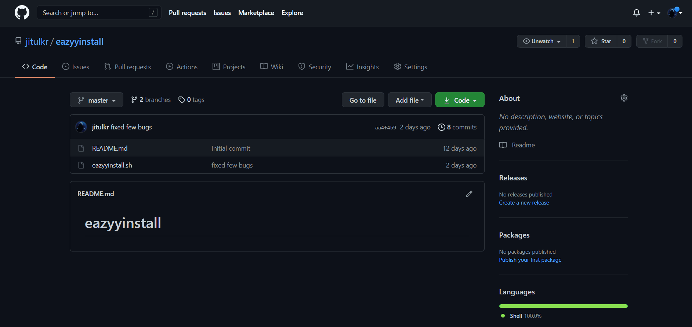

# **EazyyInstall**
--------------

### A shell script to automate software installation in Ubuntu Linux environment




-------------
# **Important!!**
## Please follow Each step below to have an error free installation.

1) First, Open the terminal:


2) Next, we need to check if we have *git* already installed. Type the following command in terminal and hit enter to do that:
```
sudo apt cache git
```
If *git* is already installed, terminal should give an output like below:


3) If *git* is not installed, we need to install *git*. To do so, typing the following command in the terminal and hit enter :
 ```
 sudo apt-get install git
 ```

2) Next, download and extract this script as shown below.

**or** Use the command below to do that automatically via terminal.
```
git clone https://github.com/jitulkr/eazyyinstall.git
```

3) Go inside the **eazyyinstall** directory.

4) Use the following command to add Execution permission:
```
sudo chmod +x eazyyinstall.sh
```
5) Enter your Ubuntu user *password* when requested.
6) To Run the **EazyyInstall** script, use the following command:
```
sudo ./eazyyinstall.sh
```
7) Now select the appropriate options as per your requirements.

## That's All.
### Enjoy Automated Software Installation.

# Want to reach us out ?
[Contact Us](mailto:jitulkrlaphong@gmail.com)
