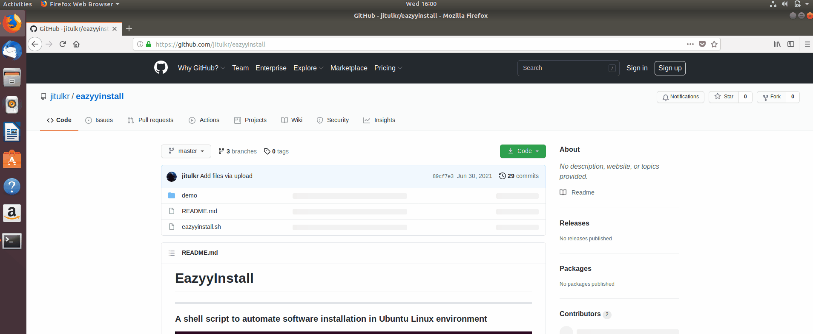

# EazyyInstall

### A shell script to automate software installation in Ubuntu Linux environment


-------------
# **Important!!**
## To ensure error free installation, Please follow Each step below.

1) First, Open the terminal:


2) Next, we need to check if we already have *git* installed. Type the following command in terminal and hit enter to do that:
```
sudo apt-cache policy git
```
If *git* is already installed, terminal should give an output something like this:
```
git:
  Installed: 1:2.17.1-1ubuntu0.8
  Candidate: 1:2.17.1-1ubuntu0.8
  Version table:
 *** 1:2.17.1-1ubuntu0.8 500
        500 http://in.archive.ubuntu.com/ubuntu bionic-updates/main amd64 Packages
        500 http://security.ubuntu.com/ubuntu bionic-security/main amd64 Packages
        100 /var/lib/dpkg/status
     1:2.17.0-1ubuntu1 500
        500 http://in.archive.ubuntu.com/ubuntu bionic/main amd64 Packages
 ```


3) If *git* is not installed, we need to install *git*. To do so, type the following command in the terminal and hit enter :
 ```
 sudo apt-get install git -y
 ```

4) If the system you are using is new (or you are using it after a while) Please update the list of available packages by typing the following command in terminal and hit enter :
 ```
 sudo apt update -y
 ```
 
5) Now Install newer versions of the packages that are already installed by typing the following command in terminal and hit enter :
 ```
 sudo apt upgrade -y
 ```
 
6) Next, download and extract this script as shown below.

                **OR**
Type the command below inside terminal to do that automatically.
```
git clone https://github.com/jitulkr/eazyyinstall.git
```
The EazyyInstall script is now downloaded to the *Downloads* folder. Close the terminal.


6) Go inside the **eazyyinstall** directory and open a new terminal here.

6) Type the following command in terminal to add Execution permission:
```
sudo chmod +x eazyyinstall.sh
```
5) Enter your Ubuntu user *password* when requested.
6) To Run the **EazyyInstall** script, type the following command in terminal:
```
sudo ./eazyyinstall.sh
```
7) Now select the appropriate options as per your requirements.

## That's All.
### Enjoy Automated Software Installation.

# Want to reach us out ?
[Contact Us](mailto:jitulkrlaphong@gmail.com)
